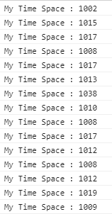
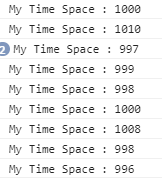

## 问答题

1. #### setTimeout 或者 setInterval 设置定时器是准时触发的吗？为什么？如果不是，他可能延时触发还是延后触发？

   不是。

   延后触发。

   因为JavaScript是单线程模型，是有一个工作队列的，因此当定时时间到的时候，不一定能够立即执行。

2. #### 如下代码 setInterval 设置的定时器激活间隔为多少？为什么？

   ```js
   setInterval(function(){
     for(var i=0;i<1000*1000*1000;i++);//假设这行代码运行需要100ms
   },1000)
   ```

   激活时间间隔是1s。

   因为`setInterval`第二个参数设置的是激活间隔，单位是毫秒，激活的时间间隔和代码运行的时间没有直接关系。只要时间到了，定时器就会将代码加入队列，继而刷新为0重新定时，到了设定时间再次激活无论目前是不是还在运行设定的代码。

3. #### 如下代码的输出是什么？为什么？

   ```js
   setTimeout(function(){
     console.log(1);
   },0)
   console.log(2);
   ```

   2 1

   因为setTimeout会延后执行

4. #### 如下代码执行结果是什么？请解释原因

   ```js
   var t = true;
   
   window.setTimeout(function (){
      t = false;
   },1000);
   while (t){}
   alert('end');
   ```

   陷入死循环

   因为不断地循环判断，即使时间间隔到了，对t的赋值操作也不停地被堵塞而不能执行。

5. #### 我们会在很多代码里看到如下语句，请说明在什么场景下需要使用如下形式代码

   ```js
   setTimeout(function(){
     // balala
     // 这里有很多代码
     // balala
   },0)
   ```

   其实相当于延后处理，经常是相对于系统文档状态更新状况延后。

   比如在一块代码中，创建一个元素，插入到文档中，再对该元素进行选中的操作。

   系统一般会等待整块代码运行完再进行状态更新，而选中的操作相对于那时的文档还不存在该元素，于是不会在更新中显示。

   这时候就应该将选中的操作写在setTimeout中来延后操作。

## 代码题

1. #### 请用 setTimeout 模拟实现 setInterval，并说明你实现的函数和系统自带的 setInterval 有什么不同

   ```js
   var myStart=new Date();
   	
   function mySetInterval(f,time){
   	setTimeout(function(){
   		f();
   		mySetInterval(f,time);
   	},time);
   }
   	
   function f(){
   	var myEnd=new Date();
   	console.log("My Time Space : " + (myEnd.getTime()-myStart.getTime()));
   	myStart=myEnd;
   	for(var x=0;x<19000000;++x);
   }
   	
   mySetInterval(f,1000);
   ```

    

   ```js
   setInterval(f,1000);
   ```

    

   通过对比观察，可以发现利用setTImeout得到的时间间隔要比setInterval的大一些

   这是因为mySetInterval的执行逻辑是执行了所需函数后再进行定时，所以需要考虑函数执行的时间，而setInterval是定时到了即会激活执行，不需要考虑函数执行的时间。